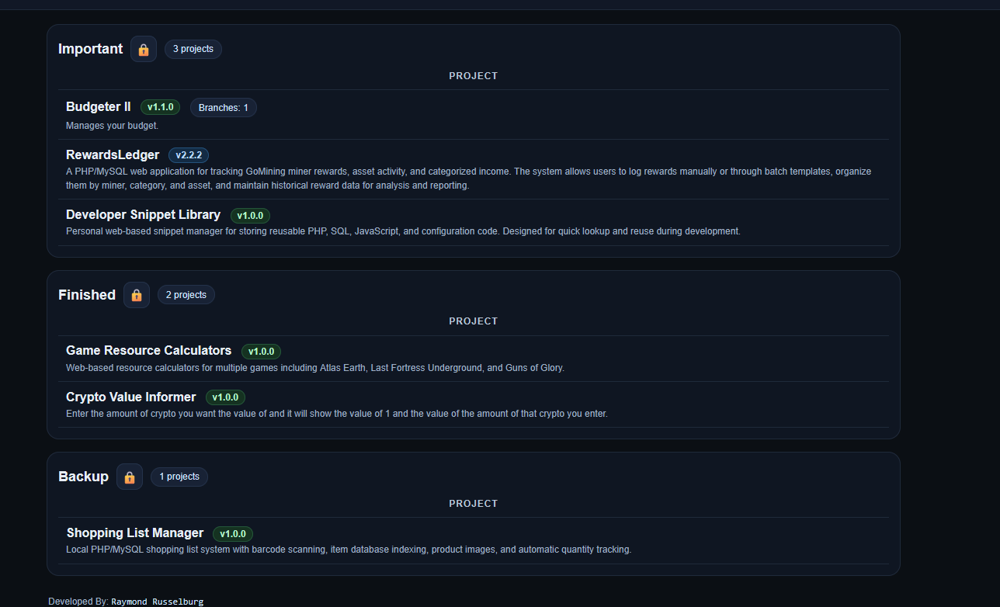
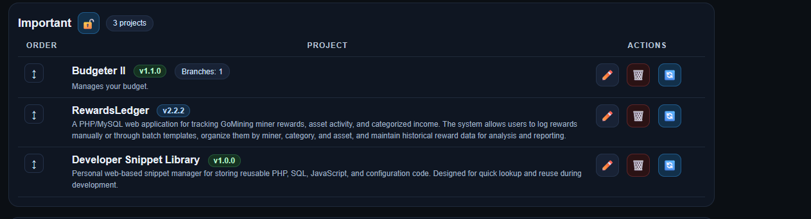
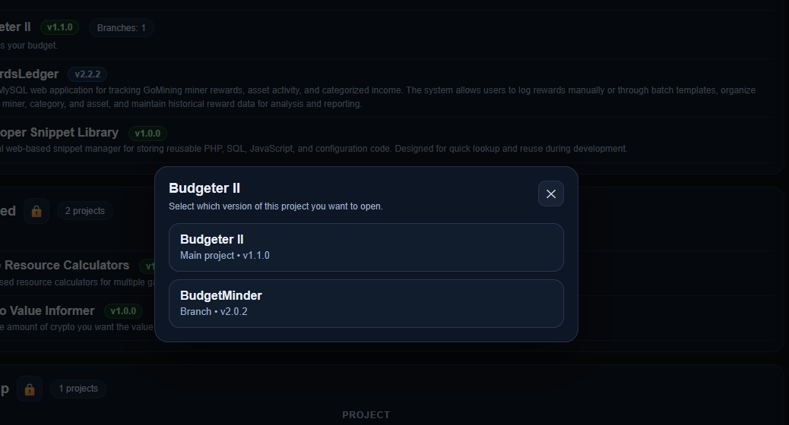
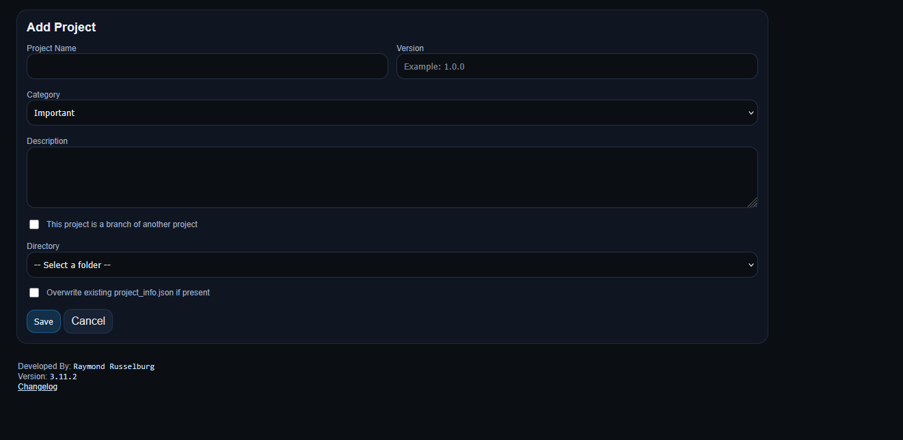
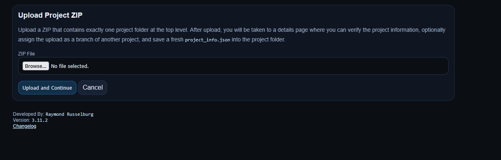

# Project Menu

<p align="center">
  <strong>A centralized project launcher, manager, and admin system for PHP-based applications.</strong>
</p>

<p align="center">
  Manage, organize, launch, and maintain multiple local web projects from a single interface.
</p> 

<p align="center">
  
  
  
  
</p>

---

## 🚀 What is Project Menu?

Project Menu is your **control center for local PHP projects**.

Instead of digging through folders, remembering URLs, or managing multiple environments manually, Project Menu gives you:

- a clean dashboard of all your projects
- categorized organization
- version tracking
- branch support
- ZIP import system
- admin tools for maintenance and recovery

It’s built specifically for developers managing **multiple local apps** and wanting a clean, structured way to access and maintain them.

---

## ✨ Core Features

### 📦 Project Launcher
- Launch any project with a single click
- Organized into categories
- Displays version, description, and branch info

---

### 🗂️ Category System
- Default categories:
  - In-Progress
  - Development
  - Finished
- Create custom categories
- Drag-and-drop reorder
- Activate/deactivate categories

---

### 🌿 Branch Support
- Link multiple versions of a project together
- Choose which branch/version to open
- Keeps main project clean while supporting variations

---

### 📥 ZIP Upload System
- Upload a full project as a ZIP
- Automatically extracts and registers it
- Option to:
  - assign as branch
  - generate `project_info.json`
  - override existing metadata

---

### 🧾 Project Metadata
Each project stores:
- Name
- Version
- Description
- Category
- Directory
- Branch relationship

---

### 🛠️ Admin & Maintenance Tools
- Install / Repair Schema
- Debug Scan (directory detection troubleshooting)
- Category management UI
- Clean separation of admin tools from main UI

---

### 🔄 Smart Project Detection
- Scans directories for projects
- Syncs with database
- Highlights missing or mismatched projects

---

## 📸 Screenshots

### Project Dashboard


---

### Category Editing Mode


---

### Branch Selection


---

### Add Project


---

### Upload Project ZIP


---

### Admin Panel


---

## ⚙️ How It Works

### 1. Add or Upload a Project
- Use **Add Project** for manual entry  
- Or upload a ZIP with a full project folder  

---

### 2. Organize Projects
- Assign categories
- Reorder with drag-and-drop
- Activate or deactivate categories

---

### 3. Use Branches (Optional)
- Link variations of a project
- Select which version to launch

---

### 4. Launch Projects
Click a project → instantly open it in your environment

---

### 5. Maintain System
Use Admin tools to:
- repair schema
- debug directory scanning
- manage categories

---

## 🧱 Installation

### Requirements
- PHP 7.4+
- MySQL / MariaDB
- Local server (recommended):
  - XAMPP
  - Laragon
  - UniServer Zero

---

### Setup

1. Place project in your web directory:

```text
/www/projects/project_menu
